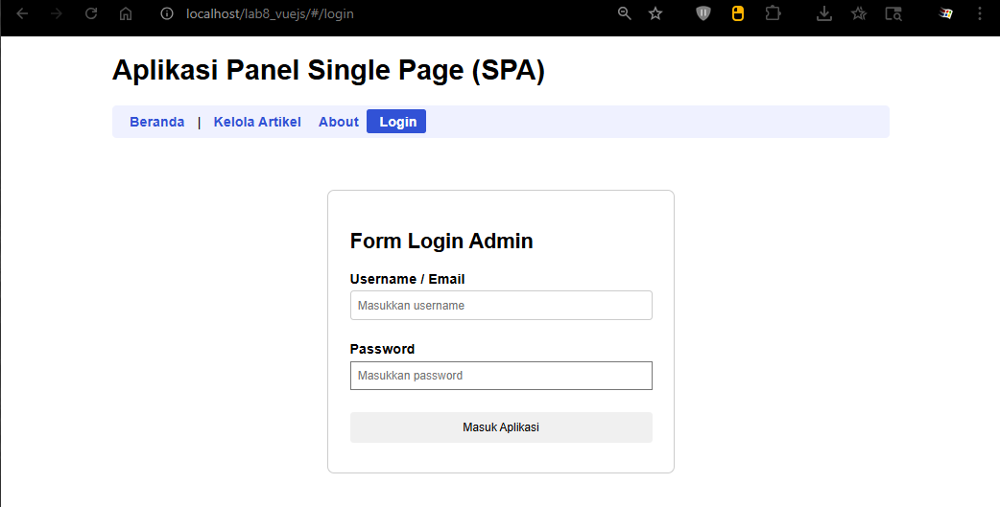
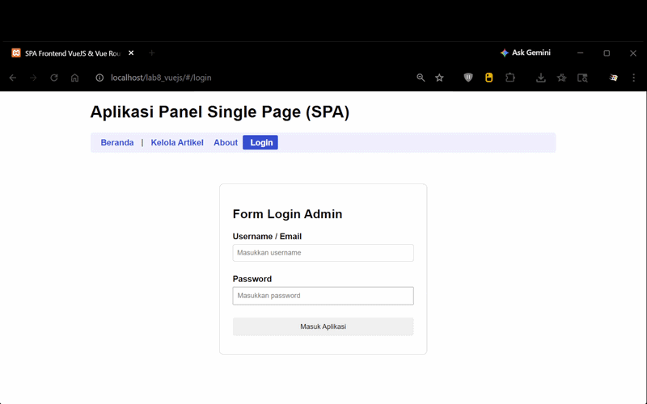
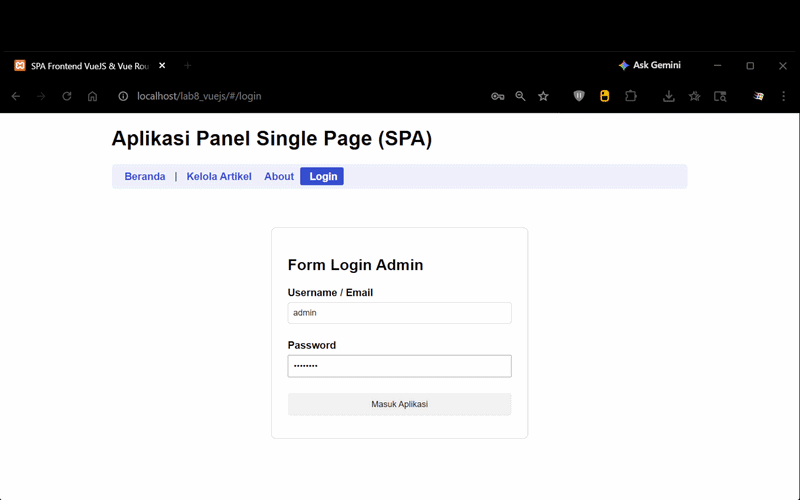
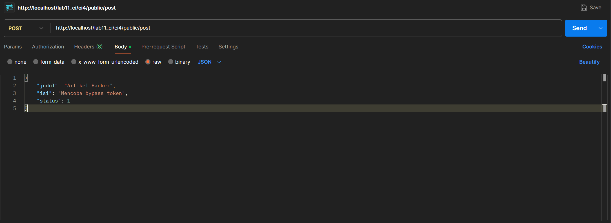
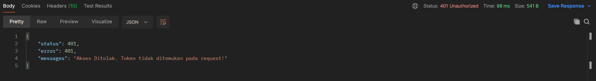
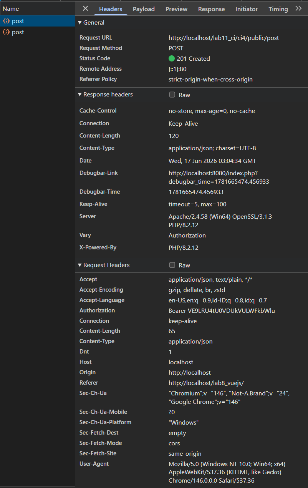
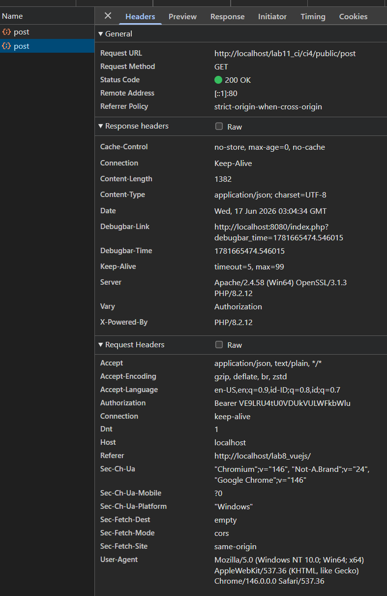

# LabWeb_VueJS

- Nama : Roufan Awaluna Romadhon
- NIM : 31240423
- Kelas : I241C

---

## Note : Repositori ini berisi Praktikum 11 sampai 14.

---

---

# Praktikum 11: VueJS

---

## Deskripsi

Tugas ini untuk memahami konsep dasar API, memahami konsep dasar Framework VueJS, dan membuat Frontend API menggunakan Framework VueJS 3

## Apa itu VueJsS?

VuesJS merupakan sebuah framework JavaScript untuk membangun aplikasi web atau tampilan interface website agar lebih interaktif. VueJS dapat digunakan untuk membangun aplikasi berbasis user interface, seperti halaman web, aplikasi mobile, dan aplikasi desktop.

Framework ini juga menawarkan berbagai fitur, seperti reactive data binding, component-based architecture, dan tools untuk membangun aplikasi skalabel. Fitur utamanya adalah rendering dan komposisi elemen, sehingga bila pengguna hendak membuat aplikasi yang lebih kompleks akan membutuhkan routing, state management, template, build-tool, dan lain sebagainya.

Adapun library VueJS berfokus pada view layer sehingga framework ini mudah untuk diimplementasikan dan diintegrasikan dengan library lain. Selain itu, VueJS juga terkenal mudah digunakan karena memiliki sintaksis yang sederhana dan intuitif, memungkinkan pengembang untuk membangun aplikasi web dengan mudah.

## Langkah-langkah

### Persiapan

Untuk memulai penggunaan framework Vuejs, dapat dialkukan dengan menggunakan npm, atau bisa juga dengan cara manual. Untuk praktikum kali ini kita akan gunakan cara manual. Yang diperlukan adalah library Vuejs, Axios untuk melakukan call API REST. Menggunakan CDN.

### Library VueJS

```
<script src="https://unpkg.com/vue@3/dist/vue.global.js"></script>
```

### Library Axios

```
<script src="https://unpkg.com/axios/dist/axios.min.js"></script>
```

### Struktur Direktory

Buat Project baru dengan struktur file dan directory seperti berikut:

```
│ index.html
└───assets
    ├───css
    │       style.css
    └───js
            app.js
```


### Menampilkan data

File index.html
```html
<!DOCTYPE html>
<html lang="en">
<head>
    <meta charset="UTF-8">
    <meta name="viewport" content="width=device-width, initial-scale=1.0">
    <title>Frontend Vuejs</title>
    <script src="https://unpkg.com/vue@3/dist/vue.global.js"></script>
    <script src="https://unpkg.com/axios/dist/axios.min.js"></script>
    <link rel="stylesheet" href="assets/css/style.css">
</head>
<body>
<div id="app">
    <h1>Daftar Artikel</h1>
    <table>
        <thead>
            <tr>
                <th>ID</th>
                <th>Judul</th>
                <th>Status</th>
                <th>Aksi</th>
            </tr>
        </thead>
        <tbody>
            <tr v-for="(row, index) in artikel">
                <td class="center-text">{{ row.id }}</td>
                <td>{{ row.judul }}</td>
                <td>{{ statusText(row.status) }}</td>
                <td class="center-text">
                    <a href="#" @click="edit(row)">Edit</a>
                    <a href="#" @click="hapus(index, row.id)">Hapus</a>
                </td>
            </tr>
        </tbody>
    </table>
</div>
<script src="assets/js/app.js"></script>
</body>
</html>
```

File app.js
```js
const { createApp } = Vue

// tentukan lokasi API REST End Point
const apiUrl = 'http://localhost/lab11_ci/ci4/public'

createApp({
    data() {
        return {
            artikel: ''
        }
    },
    mounted() {
        this.loadData()
    },
    methods: {
        loadData() {
            axios.get(apiUrl + '/post')
            .then(response => {
                this.artikel = response.data.artikel
            })
            .catch(error => console.log(error))
        },
        statusText(status) {
            if (!status) return ''
            return status == 1 ? 'Publish' : 'Draft'
        }
    },
}).mount('#app')
```

Hasil Outputnya:


### Form Tambah dan Ubah Data

Pada file index,html sispkan kode berikut sebelum table data.
```html
        <button id="btn-tambah" @click="tambah">Tambah Data</button>

        <div class="modal" v-if="showForm">
            <div class="modal-content">
                <span class="close" @click="showForm = false">&times;</span>
                <form id="form-data" @submit.prevent="saveData">
                    <h3 id="form-title">{{ formTitle }}</h3>
                    
                    <div>
                        <input type="text" name="judul" v-model="formData.judul" placeholder="Judul" required>
                    </div>
                    <div>
                        <textarea name="isi" id="isi" rows="10" v-model="formData.isi" placeholder="Isi Artikel" required></textarea>
                    </div>
                    <div>
                        <select name="status" id="status" v-model="formData.status">
                            <option v-for="option in statusOptions" :value="option.value">
                                {{ option.text }}
                            </option>
                        </select>
                    </div>
                    
                    <input type="hidden" id="id" v-model="formData.id">
                    <button type="submit" id="btnSimpan">Simpan</button>
                    <button type="button" @click="showForm = false">Batal</button>
                </form>
            </div>
        </div>
```

File app.js lengkapi kodenya.
```js
const { createApp } = Vue

// Tentukan lokasi API REST End Point sesuai backend Anda
const apiUrl = 'http://localhost/lab11_ci/ci4/public'

createApp({
    data() {
        return {
            artikel: [], // Menyimpan list artikel dari server
            formData: {
                id: null,
                judul: '',
                isi: '',
                status: 0
            },
            showForm: false, // Mengontrol visibility modal form
            formTitle: 'Tambah Data',
            statusOptions: [
                { text: 'Draft', value: 0 },
                { text: 'Publish', value: 1 }
            ]
        }
    },
    mounted() {
        // Otomatis memuat data saat aplikasi siap
        this.loadData()
    },
    methods: {
        // 1. Ambil data artikel dari server
        loadData() {
            axios.get(apiUrl + '/post')
                .then(response => {
                    // Menyesuaikan dengan struktur response dari backend
                    this.artikel = response.data.artikel
                })
                .catch(error => console.log(error))
        },
        
        // 2. Memicu form untuk tambah data baru
        tambah() {
            this.showForm = true
            this.formTitle = 'Tambah Data'
            this.formData = {
                id: null,
                judul: '',
                isi: '',
                status: 0
            }
        },
        
        // 3. Memicu form untuk mengedit data yang dipilih
        edit(data) {
            this.showForm = true
            this.formTitle = 'Ubah Data'
            this.formData = {
                id: data.id,
                judul: data.judul,
                isi: data.isi,
                status: data.status
            }
        },
        
        // 4. Menyimpan data (Logika ganda: Tambah atau Update)
        saveData() {
            if (this.formData.id) {
                // Jika memiliki ID, maka lakukan aksi UPDATE (PUT)
                axios.put(apiUrl + '/post/' + this.formData.id, this.formData)
                    .then(response => {
                        this.loadData()
                        this.showForm = false
                    })
                    .catch(error => console.log(error))
                console.log('Update item', this.formData);
            } else {
                // Jika TIDAK memiliki ID, maka lakukan aksi CREATE (POST)
                axios.post(apiUrl + '/post', this.formData)
                    .then(response => {
                        this.loadData()
                        this.showForm = false
                    })
                    .catch(error => console.log(error))
                console.log('Tambah item:', this.formData);
            }

            // Reset form data setelah selesai submit
            this.formData = {
                id: null,
                judul: '',
                isi: '',
                status: 0
            }
        },
        
        // 5. Menghapus data berdasarkan ID
        hapus(index, id) {
            if (confirm('Yakin menghapus data?')) {
                axios.delete(apiUrl + '/post/' + id)
                    .then(response => {
                        // Hapus langsung dari array lokal agar tampilan reaktif terupdate
                        this.artikel.splice(index, 1)
                    })
                    .catch(error => console.log(error))
            }
        },
        
        // Helper untuk mengubah nilai angka status menjadi teks readable
        statusText(status) {
            return status == 1 ? 'Publish' : 'Draft'
        }
    }
}).mount('#app')
```

File style.css
```css
#app {
    margin: 0 auto;
    width: 900px;
    font-family: Arial, sans-serif;
}

table {
    min-width: 700px;
    width: 100%;
    border-collapse: collapse;
    margin-top: 20px;
}

th {
    padding: 10px;
    background: #5778ff !important;
    color: #ffffff;
    text-align: left;
}

tr td {
    border-bottom: 1px solid #eff1ff;
}

tr:nth-child(odd) {
    background-color: #eff1ff;
}

td {
    padding: 10px;
}

.center-text {
    text-align: center;
}

td a {
    margin: 5px;
    color: #3152d6;
    text-decoration: none;
}

td a:hover {
    text-decoration: underline;
}

#form-data {
    width: 100%;
}

form input[type="text"],
form textarea,
form select {
    width: 100%;
    margin-bottom: 10px;
    padding: 8px;
    box-sizing: border-box;
    border: 1px solid #ccc;
    border-radius: 4px;
}

form div {
    margin-bottom: 5px;
    position: relative;
}

form button {
    padding: 10px 20px;
    margin-top: 10px;
    margin-bottom: 10px;
    margin-right: 10px;
    cursor: pointer;
    border: none;
    border-radius: 4px;
}

#btn-tambah {
    margin-bottom: 15px;
    padding: 10px 20px;
    cursor: pointer;
    background-color: #3152d6;
    color: #ffffff;
    border: 1px solid #3152d6;
    border-radius: 4px;
}

#btnSimpan {
    background-color: #3152d6;
    color: #ffffff;
    border: 1px solid #3152d6;
}

/* Modal Pop-up Styling */
.modal {
    display: block; /* Menyesuaikan kondisi v-if pada Vue */
    position: fixed;
    z-index: 100;
    left: 0;
    top: 0;
    width: 100%;
    height: 100%;
    overflow: auto;
    background-color: rgba(0, 0, 0, 0.4);
}

.modal-content {
    background-color: #fefefe;
    margin: 10% auto;
    padding: 20px;
    border: 1px solid #888;
    width: 600px;
    border-radius: 8px;
}

.close {
    color: #aaa;
    float: right;
    font-size: 28px;
    font-weight: bold;
    cursor: pointer;
}

.close:hover {
    color: #000;
}
```

Hasil Outputnya:


## Pertanyaan dan Tugas

Selesaikan programnya sesuai Langkah-langkah yang ada. Anda boleh melakukan improvisasi.

### Jawaban

Untuk improvisasi kita tambahkan kolom nomor urut saja

Penambahan di index.html
```html
<th>No</th>
```

Di bagian `v-for`:
```html
<td>{{ index + 1 }}</td>
```

Hasil:


---

# Praktikum 11: VueJS

---

## Deskripsi

Tugas ini untuk memahami konsep memahami konsep komponen pada Framework VueJS, memahami konsep Client-Side Routing untuk membangun Single Page Application (SPA) dan mengimplementasikan komponen dan routing menggunakan Vue Router berbasis CDN pada aplikasi Frontend API yang telah dibuat.

## Apa itu Vue Components dan Vue Router?

Vue Components adalah elemen UI modular yang dapat digunakan kembali (reusable).Dengan komponen, kita dapat memecah antarmuka aplikasi menjadi bagian-bagian terisolasiseperti Header, Footer, Sidebar, atau daftar data khusus, sehingga kode menjadi lebih bersihdan mudah dikelola.

Vue Router adalah library resmi untuk VueJS yang menangani pemindahan halaman di sisi klien (Client-Side Routing). Dalam aplikasi web tradisional, setiap kali tautan diklik, browser akan memuat ulang (refresh) seluruh halaman dari server. Dengan Vue Router, kita dapat beralih dari satu tampilan ke tampilan lain tanpa memuat ulang browser, menciptakan pengalaman pengguna yang sangat cepat yang dikenal sebagai Single Page Application (SPA).

## Langkah-langkah

### Persiapan

Pada praktikum ini, kita akan meningkatkan struktur project sebelumnya dengan menambahkan pustaka Vue Router menggunakan CDN.
Buka kembali file index.html dan tambahkan library Vue Router di dalam tag <head> setelah library VueJS dan Axios:

HTML
```html
<script src="https://unpkg.com/vue-router@4/dist/vue-router.global.js"></script>
```

### Struktur Direktori Baru

Untuk menjaga modularitas, sesuaikan atau pecah file JavaScript kita menjadi beberapa berkas komponen di dalam folder assets/js/components/. Ubah struktur berkas menjadi seperti berikut:

```
│ index.html
└───assets
    ├───css
    │   style.css
    └───js
        │ app.js
        └───components
            Home.js
            Artikel.js
```

### 1. Membuat File Komponen Halaman Utama (assets/js/components/Home.js)

Buat file baru bernama Home.js untuk menampilkan halaman beranda/selamat datang.

JAVASCRIPT
```js
const Home = {
    template: `
        <div class="home-container">
            <h2>Selamat Datang di Portal Admin Artikel</h2>
            <p>Gunakan menu navigasi di atas untuk mengelola data artikel secara real-time memanfaatkan RESTful API CodeIgniter 4 dan VueJS.</p>
        </div>
    `
};
```

### 2. Memindahkan Kode Fitur Artikel ke Komponen (assets/js/components/Artikel.js)

Pindahkan logika CRUD artikel dari berkas app.js lama ke dalam komponen terisolasi bernama Artikel.js.

JAVASCRIPT
```JS
const Artikel = {
    template: `
    <div>
        <h2>Manajemen Data Artikel</h2>

        <button id="btn-tambah" @click="tambah">
            Tambah Data
        </button>

        <div class="modal" v-if="showForm">
            <div class="modal-content">
                <span class="close" @click="showForm = false">&times;</span>

                <form id="form-data" @submit.prevent="saveData">
                    <h3>{{ formTitle }}</h3>

                    <div>
                        <input
                            type="text"
                            v-model="formData.judul"
                            placeholder="Judul Artikel"
                            required
                        >
                    </div>

                    <div>
                        <textarea
                            v-model="formData.isi"
                            rows="6"
                            placeholder="Isi Artikel"
                            required
                        ></textarea>
                    </div>

                    <div>
                        <select v-model="formData.status">
                            <option
                                v-for="option in statusOptions"
                                :value="option.value"
                            >
                                {{ option.text }}
                            </option>
                        </select>
                    </div>

                    <input type="hidden" v-model="formData.id">

                    <button type="submit" id="btnSimpan">
                        Simpan
                    </button>

                    <button
                        type="button"
                        @click="showForm = false"
                    >
                        Batal
                    </button>
                </form>
            </div>
        </div>

        <table>
            <thead>
                <tr>
                    <th>ID</th>
                    <th>Judul</th>
                    <th>Status</th>
                    <th>Aksi</th>
                </tr>
            </thead>

            <tbody>
                <tr
                    v-for="(row, index) in artikel"
                    :key="row.id"
                >
                    <td class="center-text">
                        {{ row.id }}
                    </td>

                    <td>
                        {{ row.judul }}
                    </td>

                    <td>
                        {{ statusText(row.status) }}
                    </td>

                    <td class="center-text">
                        <a
                            href="#"
                            @click.prevent="edit(row)"
                        >
                            Edit
                        </a>

                        <a
                            href="#"
                            @click.prevent="hapus(index,row.id)"
                        >
                            Hapus
                        </a>
                    </td>
                </tr>
            </tbody>
        </table>
    </div>
    `,

    data() {
        return {
            artikel: [],

            formData: {
                id: null,
                judul: '',
                isi: '',
                status: 0
            },

            showForm: false,

            formTitle: 'Tambah Data',

            statusOptions: [
                {
                    text: 'Draft',
                    value: 0
                },
                {
                    text: 'Publish',
                    value: 1
                }
            ]
        }
    },

    mounted() {
        this.loadData();
    },

    methods: {

        loadData() {
            axios.get(apiUrl + '/post')
                .then(response => {
                    this.artikel = response.data.artikel;
                })
                .catch(error => console.log(error));
        },

        tambah() {
            this.showForm = true;

            this.formTitle = 'Tambah Data';

            this.formData = {
                id: null,
                judul: '',
                isi: '',
                status: 0
            };
        },

        edit(data) {
            this.showForm = true;

            this.formTitle = 'Ubah Data';

            this.formData = {
                id: data.id,
                judul: data.judul,
                isi: data.isi,
                status: data.status
            };
        },

        hapus(index, id) {
            if (confirm('Yakin menghapus data?')) {

                axios.delete(apiUrl + '/post/' + id)
                    .then(response => {
                        this.artikel.splice(index, 1);
                    })
                    .catch(error => console.log(error));

            }
        },

        saveData() {

            if (this.formData.id) {

                axios.put(
                    apiUrl + '/post/' + this.formData.id,
                    this.formData
                )
                .then(response => {
                    this.loadData();
                })
                .catch(error => console.log(error));

            } else {

                axios.post(
                    apiUrl + '/post',
                    this.formData
                )
                .then(response => {
                    this.loadData();
                })
                .catch(error => console.log(error));

            }

            this.formData = {
                id: null,
                judul: '',
                isi: '',
                status: 0
            };

            this.showForm = false;
        },

        statusText(status) {
            if (!status) return 'Draft';

            return status == 1
                ? 'Publish'
                : 'Draft';
        }
    }
};
```

### 3. Mengonfigurasi Vue Router pada assets/js/app.js

Edit file app.js utama Anda untuk mendaftarkan rute internal, komponen, dan melakukan mounting aplikasi.

JAVASCRIPT
```JS
const { createApp } = Vue;
const { createRouter, createWebHashHistory } = VueRouter;

// Sesuaikan dengan project CI4 milikmu
const apiUrl = 'http://localhost/lab11_ci/ci4/public';

// Daftar route
const routes = [
    {
        path: '/',
        component: Home
    },
    {
        path: '/artikel',
        component: Artikel
    }
];

// Membuat router
const router = createRouter({
    history: createWebHashHistory(),
    routes
});

// Jalankan Vue
const app = createApp({});
app.use(router);
app.mount('#app');
```

### 4. Memodifikasi Master Layout pada index.html

Sesuaikan isi file index.html agar menyediakan menu navigasi menggunakan <router-link> dan tempat penampung halaman dinamis menggunakan <router-view>.

HTML
```html
<!DOCTYPE html>
<html lang="en">
<head>
    <meta charset="UTF-8">
    <meta name="viewport" content="width=device-width, initial-scale=1.0">
    <title>SPA Frontend VueJS & Vue Router</title>

    <script src="https://unpkg.com/vue@3/dist/vue.global.js"></script>
    <script src="https://unpkg.com/vue-router@4/dist/vue-router.global.js"></script>
    <script src="https://unpkg.com/axios/dist/axios.min.js"></script>

    <link rel="stylesheet" href="assets/css/style.css">
</head>
<body>

    <div id="app">

        <header>
            <h1>Aplikasi Panel Single Page (SPA)</h1>

            <nav class="nav-menu">
                <router-link to="/">Beranda</router-link> |
                <router-link to="/artikel">Kelola Artikel</router-link>
            </nav>
        </header>

        <main style="margin-top:20px;">
            <router-view></router-view>
        </main>

    </div>

    <script src="assets/js/components/Home.js"></script>
    <script src="assets/js/components/Artikel.js"></script>
    <script src="assets/js/app.js"></script>

</body>
</html>
```

## Hasil


## Pertanyaan dan Tugas

1. Selesaikan semua langkah praktikum di atas.
2. Tambahkan satu rute baru (/about) beserta komponen About.js baru yang berisi profil singkat Anda (Nama, NIM, Kelas, dan Foto/Avatar). Masukkan tautan rutenya ke dalam menu navigasi atas pada index.html.
3. Lakukan pengujian perpindahan halaman menu (Beranda, Kelola Artikel, dan About) dan pastikan browser tidak melakukan hard-reload (SPA bekerja).

### Jawaban

1. Sudah Selesai

2. Berikut yg saya tambahkan dan ubah untuk halaman about:

Buat file `about.js`
```
assets/js/components/About.js
```

isi file:
```js
const About = {
    template: `
    <div class="about-container">

        <h2>Profil Mahasiswa</h2>

        <div class="profile-card">

            

            <h3>Roufan Awaluna Romadhon</h3>

            <p><strong>NIM:</strong> 31210423</p>

            <p><strong>Kelas:</strong> I241C</p>

            <p>
                Hanya Mahasiswa Biasa.
            </p>

        </div>

    </div>
    `
};
```

Penambahan routes di `app.js`
```js
const routes = [
    {
        path: '/',
        component: Home
    },
    {
        path: '/artikel',
        component: Artikel
    },
    {
        path: '/about',
        component: About
    }
];
```

Penambahan script `about.js` di `index.php`

```html
<script src="assets/js/components/Home.js"></script>
<script src="assets/js/components/Artikel.js"></script>
<script src="assets/js/components/About.js"></script>
<script src="assets/js/app.js"></script>
```

Penambhana menu navigasi
```html
<nav class="nav-menu">
    <router-link to="/">Beranda</router-link> |
    <router-link to="/artikel">Kelola Artikel</router-link> |
    <router-link to="/about">About</router-link>
</nav>
```

Menambahkan foto profil

Buat folder baru seperti berikut, dan masukan foto di folder img.
```
assets
│
├── css
├── js
└── img
    └── avatar.jpg
```

Penambahan CSS
```css
.about-container {
    text-align: center;
    padding: 20px;
}

.profile-card {
    max-width: 400px;
    margin: auto;
    padding: 20px;
    border: 1px solid #ddd;
    border-radius: 10px;
    background: #fafafa;
}

.profile-image {
    width: 150px;
    height: 150px;
    border-radius: 50%;
    object-fit: cover;
    margin-bottom: 15px;
}
```

Hasil:


3. Berikut Hasil Pengujiannya


---

# Praktikum 13: VueJS Autentikasi dan Navigation Guards (SPA Security)

---

## Deskripsi

Tugas ini untuk memahami konsep keamanan dan pembatasan hak akses rute pada sisi klien (Client-Side Security), memahami konsep Navigation Guards (beforeEach) pada Vue Router, membuat API Endpoint autentikasi pada backend CodeIgniter 4 dan mengimplementasikan modul Login dan proteksi halaman admin pada aplikasi Single Page Application (SPA) Frontend API.

## Teori Singkat

Apa itu Navigation Guards?
Dalam aplikasi web tradisional berbasis server-side (seperti MVC standar CodeIgniter), proteksi halaman dilakukan menggunakan Filters atau Middleware sebelum halaman HTML dirender oleh server. Namun, pada arsitektur Single Page Application (SPA), seluruh struktur halaman web sudah dimuat di awal oleh browser klien.

Untuk mengamankan rute-rute internal tertentu (seperti halaman /artikel) agar tidak bisa dibuka oleh pengguna yang belum melakukan autentikasi, Vue Router menyediakan fitur Navigation Guards melalui fungsi router.beforeEach(). Fungsi ini bertindak sebagai interceptor (pencegat) perpindahan rute yang akan memeriksa status login pengguna (misalnya memeriksa keberadaan token login di localStorage) sebelum mengizinkan rute tersebut ditampilkan ke layar browser.

## Langkah-langkah

### TAHAP 1: PEMBUATAN API ENDPOINT LOGIN (SISI BACKEND CI4)
Sebelum masuk ke konfigurasi antarmuka klien, kita harus menyediakan endpoint REST API di CodeIgniter 4 untuk memvalidasi kredensial pengguna yang dikirim dari aplikasi frontend.

Langkah 1.1: Membuat Auth Controller Buat berkas controller baru pada direktori proyek backend Anda di app/Controllers/Api/Auth.php, kemudian ketikkan kode berikut:

PHP
```php

```

Langkah 1.2: Mendaftarkan Route API Login Buka berkas konfigurasi routing backend Anda di app/Config/Routes.php, lalu daftarkan rute khusus penanganan proses login dengan metode POST:

PHP
```php
$routes->post('api/login', 'Api\Auth::login');
```

### TAHAP 2: PENGEMBANGAN INTEGRASI FRONTEND (SISI VUEJS SPA)
Sesuaikan struktur direktori pada folder proyek frontend lab8_vuejs Anda agar memiliki berkas komponen Login.js yang baru seperti struktur berikut:

```
lab8_vuejs/
│ index.html
└───assets/
    ├───css/
    │   style.css
    └───js/
        │ app.js
        └───components/
            Home.js
            Artikel.js
            Login.js
```

Langkah 2.1: Membuat Komponen Login (assets/js/components/Login.js) Buat file baru bernama Login.js di dalam folder components/. Komponen ini berfungsi menampilkan form login, merekam input, dan mengirimkannya ke API Backend menggunakan Axios.

JavaScript
```js
const Login = {
    template: `
    <div class="login-container">

        <div class="login-box">

            <h2>Form Login Admin</h2>

            <form @submit.prevent="handleLogin">

                <div class="form-group">
                    <label>Username / Email</label>
                    <input
                        type="text"
                        v-model="username"
                        placeholder="Masukkan username"
                        required
                    >
                </div>

                <div class="form-group">
                    <label>Password</label>
                    <input
                        type="password"
                        v-model="password"
                        placeholder="Masukkan password"
                        required
                    >
                </div>

                <button
                    type="submit"
                    class="btn-login"
                >
                    Masuk Aplikasi
                </button>

            </form>

            <p
                v-if="errorMessage"
                class="error-msg"
            >
                {{ errorMessage }}
            </p>

        </div>

    </div>
    `,

    data() {
        return {
            username: '',
            password: '',
            errorMessage: ''
        }
    },

    methods: {

        handleLogin() {

            axios.post(
                apiUrl + '/api/login',
                {
                    username: this.username,
                    password: this.password
                }
            )
            .then(response => {

                if (response.data.status === 200) {

                    localStorage.setItem(
                        'isLoggedIn',
                        'true'
                    );

                    localStorage.setItem(
                        'userToken',
                        response.data.data.token
                    );

                    this.$router.push('/artikel');

                    window.location.reload();
                }

            })
            .catch(error => {

                if (
                    error.response &&
                    error.response.data.messages
                ) {

                    this.errorMessage =
                        error.response.data.messages;

                } else {

                    this.errorMessage =
                        'Terjadi kesalahan jaringan atau server.';
                }
            });

        }

    }
};
```

Langkah 2.2: Mengonfigurasi Proteksi Rute dan Guards pada assets/js/app.js Buka berkas app.js. Daftarkan komponen Login, tambahkan properti meta: { requiresAuth: true } pada rute artikel, serta buat fungsi kontrol beforeEach.

JavaScript
```js
const { createApp } = Vue;
const { createRouter, createWebHashHistory } = VueRouter;

const apiUrl = 'http://localhost/lab11_ci/ci4/public';

const routes = [
    {
        path: '/',
        component: Home
    },
    {
        path: '/login',
        component: Login
    },
    {
        path: '/artikel',
        component: Artikel,
        meta: {
            requiresAuth: true
        }
    },
    {
        path: '/about',
        component: About,
        meta: {
            requiresAuth: true
        }
    }
];

const router = createRouter({
    history: createWebHashHistory(),
    routes
});

router.beforeEach((to, from, next) => {

    const isAuthenticated =
        localStorage.getItem('isLoggedIn') === 'true';

    if (
        to.matched.some(
            record => record.meta.requiresAuth
        ) &&
        !isAuthenticated
    ) {

        alert(
            'Akses Ditolak! Anda harus login terlebih dahulu.'
        );

        next('/login');

    } else {

        next();

    }

});

const app = createApp({

    data() {
        return {
            isLoggedIn: false
        }
    },

    mounted() {

        this.isLoggedIn =
            localStorage.getItem('isLoggedIn') === 'true';

    },

    methods: {

        logout() {

            if (
                confirm(
                    'Apakah Anda yakin ingin keluar aplikasi?'
                )
            ) {

                localStorage.removeItem(
                    'isLoggedIn'
                );

                localStorage.removeItem(
                    'userToken'
                );

                this.isLoggedIn = false;

                this.$router.push('/');
            }

        }

    }

});

app.use(router);

app.mount('#app');
```

Langkah 2.3: Menyesuaikan Tata Letak Dinamis pada index.html Buka file index.html utama. Muat skrip komponen Login.js dan tambahkan direktif v-if / v-else pada menu navigasi bagian atas untuk merubah link login/logout secara dinamis.

HTML
```html
<nav class="nav-menu">

    <router-link to="/">
        Beranda
    </router-link>

    |

    <router-link to="/artikel">
        Kelola Artikel
    </router-link>

    |

    <router-link
        v-if="!isLoggedIn"
        to="/login"
    >
        Login
    </router-link>

    <a
        v-else
        href="#"
        @click.prevent="logout"
    >
        Logout
    </a>

</nav>
```

```html
<script src="assets/js/components/Login.js"></script>
```

Langkah 2.4: Menambahkan Desain Antarmuka Form pada assets/css/style.css Tambahkan pengaturan kode CSS berikut pada bagian paling bawah file stylesheet Anda agar tampilan kotak formulir login berada rapi di tengah halaman web:

CSS
```css
.login-container {
    display: flex;
    justify-content: center;
    align-items: center;
    padding: 40px 0;
}

.login-box {
    width: 350px;
    padding: 25px;
    border: 1px solid #ccc;
    border-radius: 8px;
    background-color: #ffffff;
}

.form-group {
    margin-bottom: 15px;
}

.form-group label {
    display: block;
    margin-bottom: 5px;
    font-weight: bold;
}

.form-group input {
    width: 100%;
    padding: 8px;
    box-sizing: border-box;
}

.btn-login {
    width: 100%;
    padding: 10px;
}

.error-msg {
    color: red;
    text-align: center;
}
```

Hasil :



## Pertanyaan dan Tugas

1. Selesaikan seluruh pengerjaan kode pemrograman sistem autentikasi API di atas.

2. Jalankan pengujian skenario kontrol keamanan berikut pada browser:

- Skenario A (Kondisi Terkunci): Bersihkan penyimpanan local storage browser (atau dalam keadaan belum login). Tekan menu navigasi "Kelola Artikel". Amati jalannya aplikasi, apakah sistem berhasil menolak akses secara langsung, memunculkan alert, dan melempar halaman tampilan ke form login.
- Skenario B (Kondisi Login Terautentikasi): Buka form login, masukkan data akun pengguna yang valid sesuai isi database user Anda. Amati apakah sistem berhasil memvalidasi kredensial ke database backend melalui Axios, membawa Anda masuk ke halaman tabel artikel, serta merubah tombol menu login atas menjadi link "Logout".

3. Terapkan pengaman rute serupa (meta: { requiresAuth: true }) untuk komponen halaman About.js (profil mahasiswa) yang telah dibuat pada Praktikum 12, sehingga menu tersebut ikut terproteksi dari pengguna luar.

### Jawaban

1. Sudah Selesai

2. Berikut dua skenarionya

Skenario A (Kondisi Terkunci)



Skenario B (Kondisi Login Terautentikasi)



3. Untuk Pengaman di About.js kita ubah di app.js nya

```
{
    path: '/about',
    component: About,
    meta: {
        requiresAuth: true
    }
}
```

Hasil :


### penjelasan analisis ringkas mengenai alur kerja fungsional dari router.beforeEach dan Axios HTTP Post

1. Analisis Alur Kerja router.beforeEach

router.beforeEach merupakan fitur Navigation Guard pada Vue Router yang digunakan untuk melakukan pemeriksaan sebelum pengguna berpindah ke suatu halaman (route). Pada praktikum ini, fungsi tersebut digunakan untuk mengamankan halaman yang memerlukan autentikasi, seperti halaman Kelola Artikel dan About.

Alur kerjanya dimulai ketika pengguna mencoba mengakses suatu route. Sistem kemudian memeriksa apakah route tersebut memiliki properti meta: { requiresAuth: true }. Jika route membutuhkan autentikasi, aplikasi akan mengecek status login pengguna yang disimpan pada localStorage melalui variabel isLoggedIn. Apabila pengguna belum login, sistem akan menampilkan pesan peringatan (alert) dan mengarahkan pengguna ke halaman Login menggunakan next('/login'). Sebaliknya, jika pengguna sudah login, maka akses ke halaman yang dituju akan diizinkan dengan menjalankan next().

Dengan mekanisme ini, halaman yang bersifat privat dapat terlindungi dari akses pengguna yang belum terautentikasi.

2. Analisis Alur Kerja Axios HTTP POST

Axios HTTP POST digunakan untuk mengirim data dari aplikasi VueJS ke backend CodeIgniter 4. Pada praktikum ini, metode POST digunakan saat proses login pengguna.

Alur kerjanya dimulai ketika pengguna mengisi username dan password pada form login, kemudian menekan tombol Login. Data tersebut dikirim ke endpoint API menggunakan perintah axios.post(). Selanjutnya backend CodeIgniter menerima data login dan melakukan validasi terhadap data pengguna yang tersimpan pada database.

Jika username dan password valid, server akan mengirimkan respons sukses yang berisi informasi pengguna dan token autentikasi. Data tersebut kemudian disimpan ke dalam localStorage, sehingga status login pengguna dapat dikenali oleh aplikasi. Setelah itu pengguna diarahkan ke halaman Kelola Artikel. Namun jika data login tidak valid, server akan mengirimkan pesan kesalahan dan aplikasi akan menampilkan informasi bahwa username atau password yang dimasukkan salah.

Penggunaan Axios HTTP POST memungkinkan pertukaran data antara frontend dan backend berlangsung secara asinkron tanpa perlu melakukan reload halaman, sehingga aplikasi menjadi lebih responsif dan nyaman digunakan.

---

# Praktikum 14: Keamanan API, Autentikasi Token, dan Axios Interceptors

---

## Deskripsi

Tugas ini untuk memahami konsep memahami konsep keamanan RESTful API menggunakan Token-Based Authentication, mengimplementasikan Filters pada CodeIgniter 4 untuk mengamankan endpoint API dari akses ilegal, memahami dan mengimplementasikan fungsi Axios Interceptors pada aplikasi Frontend VueJS dan melakukan pengujian transmisi data yang aman antara Frontend SPA dan Backend API secara end-to-end.

## Teori Singkat

Pada praktikum sebelumnya, kita baru menerapkan Client-Side Security (keamanan di sisi browser menggunakan Vue Router). Keamanan tersebut belum cukup, sebab orang lain masih bisa menembak database kita secara langsung melalui URL endpoint REST API (seperti /post dengan metode POST/PUT/DELETE) menggunakan tools seperti Postman. Oleh karena itu, diperlukan Server-Side Security menggunakan token.

Saat pengguna berhasil login, server akan memberikan sebuah string acak unik (Token). Token ini wajib disimpan oleh aplikasi klien dan harus dilampirkan pada bagian HTTP Heade (Authorization: Bearer <token>) setiap kali klien meminta data sensitif atau melakukan perubahan data ke server.

Di sisi klien, untuk menghindari penulisan kode pelampiran token secara manual di setiap fungsi axios.get atau axios.post, kita dapat menggunakan Axios Interceptors. Fitur ini berfungsi seperti "jembatan otomatis" yang mencegat setiap request keluar dari aplikasi VueJS untuk menyuntikkan token dari localStorage ke dalam HTTP Header secara global.

## Langkah-langkah

### TAHAP 1: MENGAMANKAN ENDPOINT API (SISI BACKEND CI4)

Langkah 1.1: Membuat API Auth Filter

Kita akan membuat filter khusus yang bertugas memeriksa apakah request yang masuk ke server membawa Token valid pada HTTP Header-nya. Buat file filter baru bernama ApiAuthFilter.php di dalam folder app/Filters/ dan ketikkan kode berikut:

PHP
```php
<?php

namespace App\Filters;

use CodeIgniter\Filters\FilterInterface;
use CodeIgniter\Http\RequestInterface;
use CodeIgniter\Http\ResponseInterface;
use Config\Services;

class ApiAuthFilter implements FilterInterface
{
    public function before(
        RequestInterface $request,
        $arguments = null
    )
    {
        // Ambil Authorization Header
        $authHeader =
            $request->getServer(
                'HTTP_AUTHORIZATION'
            );

        if (!$authHeader) {

            $response =
                Services::response();

            $response->setStatusCode(401);

            return $response->setJSON([
                'status' => 401,
                'error' => 401,
                'messages' =>
                    'Akses Ditolak. Token tidak ditemukan pada request!'
            ]);
        }

        $token = null;

        if (
            preg_match(
                '/Bearer\s(\S+)/',
                $authHeader,
                $matches
            )
        ) {

            $token = $matches[1];
        }

        if (
            !$token ||
            empty($token)
        ) {

            $response =
                Services::response();

            $response->setStatusCode(401);

            return $response->setJSON([
                'status' => 401,
                'error' => 401,
                'messages' =>
                    'Sesi Token tidak valid atau kedaluwarsa!'
            ]);
        }
    }

    public function after(
        RequestInterface $request,
        ResponseInterface $response,
        $arguments = null
    )
    {
        // Tidak diperlukan aksi
    }
}
```

Langkah 1.2: Mendaftarkan Filter API

Buka file konfigurasi filter di app/Config/Filters.php. Daftarkan class filter yang baru saja dibuat ke dalam array $aliases:

PHP
```php
public array $aliases = [
    'csrf' => \\CodeIgniter\\Filters\\CSRF::class,
    'toolbar' => \\CodeIgniter\\Filters\\DebugToolbar::class,
    'honeypot' => \\CodeIgniter\\Filters\\Honeypot::class,
    'invalidchars' => \\CodeIgniter\\Filters\\InvalidChars::class,
    'secureheaders' => \\CodeIgniter\\Filters\\SecureHeaders::class,
    // Daftarkan filter baru Anda di bawah ini
    'apiauth' => \\App\\Filters\\ApiAuthFilter::class,
];
```

Langkah 1.3: Menerapkan Filter ke Route Artikel

Buka file app/Config/Routes.php. Terapkan filter 'apiauth' khusus untuk memproteksi manipulasi data artikel (POST, PUT, DELETE) agar tidak bisa ditembak sembarangan tanpa token.

PHP
```php
// Mengamankan method POST, PUT, dan DELETE untuk resource /post
$routes->post('post', 'Api\\Post::create', ['filter' => 'apiauth']);
$routes->put('post/(:segment)', 'Api\\Post::update/$1', ['filter' => 'apiauth']);
$routes->delete('post/(:segment)', 'Api\\Post::delete/$1', ['filter' => 'apiauth']);
```

### TAHAP 2: IMPLEMENTASI AXIOS INTERCEPTORS (SISI VUEJS FRONTEND)

Langkah 2.1: Menambahkan Konfigurasi Interceptor Global pada assets/js/app.js

Buka berkas utama frontend Anda di assets/js/app.js. Tambahkan konfigurasi pencegat (Interceptor) Axios tepat sebelum baris kode inisialisasi const app = createApp({});.
Fungsi ini akan otomatis menyuntikkan token yang tersimpan di localStorage ke dalam setiap request data menuju ke backend.

```js
axios.interceptors.request.use(

    (config) => {

        const token =
            localStorage.getItem(
                'userToken'
            );

        if (token) {

            config.headers[
                'Authorization'
            ] =
                'Bearer ' + token;
        }

        return config;
    },

    (error) => {

        return Promise.reject(
            error
        );
    }
);
```

```js
axios.interceptors.response.use(

    (response) => {

        return response;
    },

    (error) => {

        if (
            error.response &&
            error.response.status === 401
        ) {

            alert(
                'Sesi Anda telah berakhir atau Token tidak sah. Silakan login kembali.'
            );

            localStorage.clear();

            window.location.href =
                '#/login';

            window.location.reload();
        }

        return Promise.reject(
            error
        );
    }
);
```

## Pertanyaan dan Tugas

1. Terapkan seluruh langkah pembuatan kode pengamanan Token-Based Authentication di atas baik pada backend (CI4) maupun frontend (VueJS).

2. Lakukan simulasi pengujian pembobolan database menggunakan aplikasi REST Client seperti Postman atau Insomnia:
- Tembak URL input data artikel backend Anda (http://localhost/labci4/public/post) menggunakan metode POST tanpa menyertakan token di bagian headers.
- Amati hasil respon JSON yang diberikan oleh CodeIgniter 4. Pastikan statusnya mengembalikan error HTTP 401 Unauthorized.

3. Buka aplikasi web utama lewat browser, lakukan login, lalu coba lakukan manipulasi data artikel (Tambah/Ubah/Hapus). Berkat Axios Interceptors, proses manipulasi data harus berjalan sukses karena token dikirim secara terselubung di latar belakang sistem.

4. Tuliskan kesimpulan akhir dari hasil analisis Anda mengenai perbedaan mendasar fungsi perlindungan keamanan antara Vue Router Navigation Guards (sisi klien) dan CodeIgniter Filters (sisi server).

### Jawaban

1. Sudah Selesai

2. Hasil Pengujian:





- Pengujian dilakukan menggunakan Postman dengan metode POST ke endpoint /post tanpa menyertakan header Authorization.
- Sistem berhasil menolak akses dan mengembalikan status HTTP 401 Unauthorized.
- Hal ini menunjukkan bahwa filter ApiAuthFilter berhasil melindungi endpoint API dari akses tidak sah.

3. Hasil Pengujian:

- Pengguna melakukan login melalui aplikasi VueJS menggunakan akun yang valid.
- Saat melakukan operasi Tambah, Ubah, dan Hapus artikel, Axios Interceptors secara otomatis menyisipkan header Authorization Bearer Token ke setiap request.
- Operasi CRUD berjalan dengan sukses tanpa perlu menambahkan token secara manual pada setiap request.
- Hasil ini membuktikan bahwa mekanisme autentikasi berbasis token telah berjalan dengan baik.





4. Kesimpulan

Berdasarkan hasil pengujian yang telah dilakukan, dapat disimpulkan bahwa Vue Router Navigation Guards dan CodeIgniter Filters memiliki fungsi perlindungan keamanan yang berbeda tetapi saling melengkapi. Vue Router Navigation Guards bekerja di sisi klien (frontend) dengan cara mengontrol perpindahan halaman pada aplikasi Single Page Application (SPA). Mekanisme ini digunakan untuk memeriksa status login pengguna sebelum mengakses halaman tertentu, seperti halaman Kelola Artikel atau About. Jika pengguna belum terautentikasi, sistem akan menolak akses dan mengarahkan pengguna ke halaman login. Dengan demikian, Navigation Guards berfungsi sebagai lapisan keamanan awal untuk meningkatkan pengalaman pengguna dan membatasi akses antarmuka aplikasi.

Di sisi lain, CodeIgniter Filters bekerja di sisi server (backend) dan berfungsi sebagai lapisan keamanan yang lebih kuat. Filter akan memeriksa setiap request yang masuk ke API, termasuk validasi token autentikasi pada operasi yang sensitif seperti tambah, ubah, dan hapus data. Hasil pengujian menggunakan Postman menunjukkan bahwa request tanpa token berhasil ditolak dengan status 401 Unauthorized, sehingga meskipun seseorang mencoba mengakses API secara langsung tanpa melalui aplikasi web, data tetap terlindungi.

Dengan demikian, perbedaan mendasar keduanya adalah bahwa Vue Router Navigation Guards berfokus pada pengamanan navigasi dan akses halaman di sisi klien, sedangkan CodeIgniter Filters berfokus pada pengamanan data dan endpoint API di sisi server. Dalam implementasi yang baik, kedua mekanisme harus digunakan secara bersamaan karena Navigation Guards saja tidak cukup untuk melindungi API, sedangkan Filters memastikan keamanan tetap terjaga meskipun terjadi upaya akses langsung atau manipulasi request dari luar aplikasi.