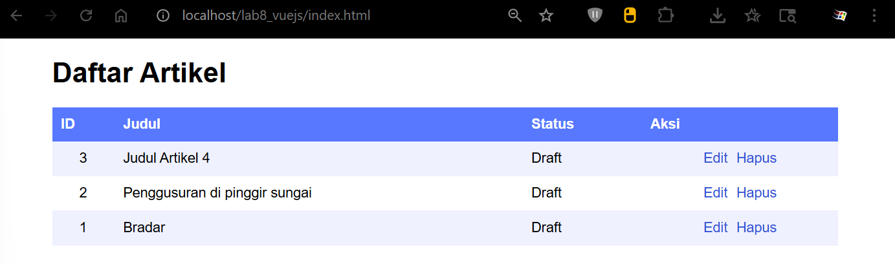
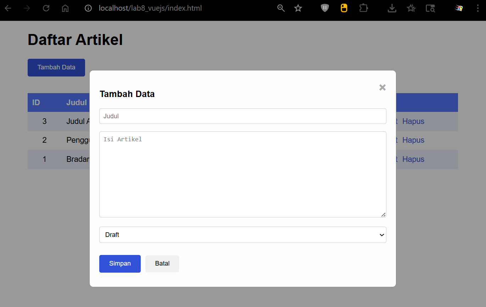
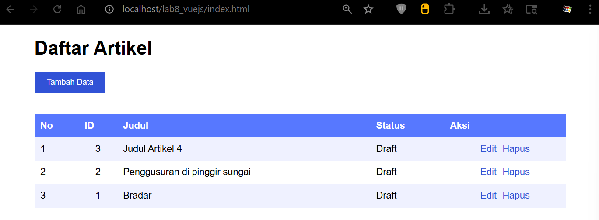
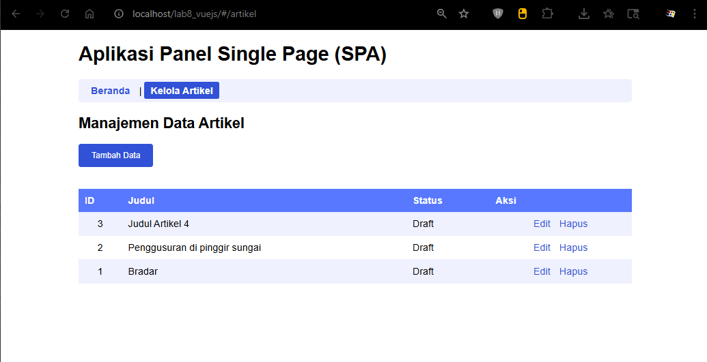
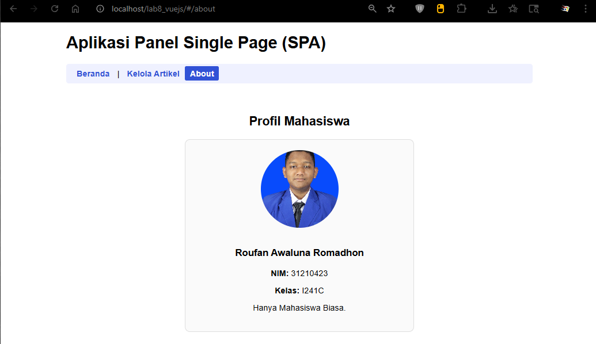
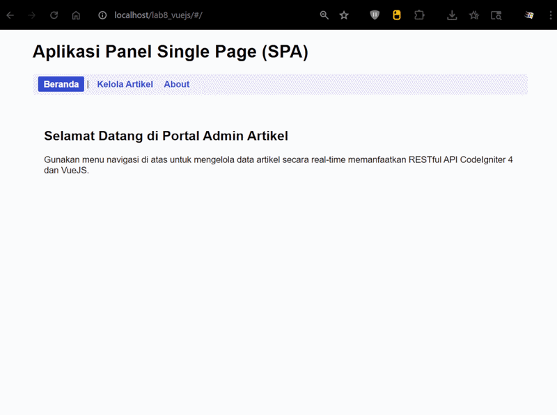

# LabWeb_VueJS

- Nama : Roufan Awaluna Romadhon
- NIM : 31240423
- Kelas : I241C

---

## Note : Repositori ini berisi Praktikum 11 sampai 12.

---

---

# Praktikum 11: VueJS

---

## Deskripsi

Tugas ini untuk memahami konsep dasar API, memahami konsep dasar Framework VueJS, dan membuat Frontend API menggunakan Framework VueJS 3

## Apa itu VueJsS?

VuesJS merupakan sebuah framework JavaScript untuk membangun aplikasi web atau tampilan interface website agar lebih interaktif. VueJS dapat digunakan untuk membangun aplikasi berbasis user interface, seperti halaman web, aplikasi mobile, dan aplikasi desktop.

Framework ini juga menawarkan berbagai fitur, seperti reactive data binding, component-based architecture, dan tools untuk membangun aplikasi skalabel. Fitur utamanya adalah rendering dan komposisi elemen, sehingga bila pengguna hendak membuat aplikasi yang lebih kompleks akan membutuhkan routing, state management, template, build-tool, dan lain sebagainya.

Adapun library VueJS berfokus pada view layer sehingga framework ini mudah untuk diimplementasikan dan diintegrasikan dengan library lain. Selain itu, VueJS juga terkenal mudah digunakan karena memiliki sintaksis yang sederhana dan intuitif, memungkinkan pengembang untuk membangun aplikasi web dengan mudah.

## Langkah-langkah

### Persiapan

Untuk memulai penggunaan framework Vuejs, dapat dialkukan dengan menggunakan npm, atau bisa juga dengan cara manual. Untuk praktikum kali ini kita akan gunakan cara manual. Yang diperlukan adalah library Vuejs, Axios untuk melakukan call API REST. Menggunakan CDN.

### Library VueJS

```
<script src="https://unpkg.com/vue@3/dist/vue.global.js"></script>
```

### Library Axios

```
<script src="https://unpkg.com/axios/dist/axios.min.js"></script>
```

### Struktur Direktory

Buat Project baru dengan struktur file dan directory seperti berikut:

```
│ index.html
└───assets
    ├───css
    │       style.css
    └───js
            app.js
```


### Menampilkan data

File index.html
```html
<!DOCTYPE html>
<html lang="en">
<head>
    <meta charset="UTF-8">
    <meta name="viewport" content="width=device-width, initial-scale=1.0">
    <title>Frontend Vuejs</title>
    <script src="https://unpkg.com/vue@3/dist/vue.global.js"></script>
    <script src="https://unpkg.com/axios/dist/axios.min.js"></script>
    <link rel="stylesheet" href="assets/css/style.css">
</head>
<body>
<div id="app">
    <h1>Daftar Artikel</h1>
    <table>
        <thead>
            <tr>
                <th>ID</th>
                <th>Judul</th>
                <th>Status</th>
                <th>Aksi</th>
            </tr>
        </thead>
        <tbody>
            <tr v-for="(row, index) in artikel">
                <td class="center-text">{{ row.id }}</td>
                <td>{{ row.judul }}</td>
                <td>{{ statusText(row.status) }}</td>
                <td class="center-text">
                    <a href="#" @click="edit(row)">Edit</a>
                    <a href="#" @click="hapus(index, row.id)">Hapus</a>
                </td>
            </tr>
        </tbody>
    </table>
</div>
<script src="assets/js/app.js"></script>
</body>
</html>
```

File app.js
```js
const { createApp } = Vue

// tentukan lokasi API REST End Point
const apiUrl = 'http://localhost/lab11_ci/ci4/public'

createApp({
    data() {
        return {
            artikel: ''
        }
    },
    mounted() {
        this.loadData()
    },
    methods: {
        loadData() {
            axios.get(apiUrl + '/post')
            .then(response => {
                this.artikel = response.data.artikel
            })
            .catch(error => console.log(error))
        },
        statusText(status) {
            if (!status) return ''
            return status == 1 ? 'Publish' : 'Draft'
        }
    },
}).mount('#app')
```

Hasil Outputnya:



### Form Tambah dan Ubah Data

Pada file index,html sispkan kode berikut sebelum table data.
```html
        <button id="btn-tambah" @click="tambah">Tambah Data</button>

        <div class="modal" v-if="showForm">
            <div class="modal-content">
                <span class="close" @click="showForm = false">&times;</span>
                <form id="form-data" @submit.prevent="saveData">
                    <h3 id="form-title">{{ formTitle }}</h3>
                    
                    <div>
                        <input type="text" name="judul" v-model="formData.judul" placeholder="Judul" required>
                    </div>
                    <div>
                        <textarea name="isi" id="isi" rows="10" v-model="formData.isi" placeholder="Isi Artikel" required></textarea>
                    </div>
                    <div>
                        <select name="status" id="status" v-model="formData.status">
                            <option v-for="option in statusOptions" :value="option.value">
                                {{ option.text }}
                            </option>
                        </select>
                    </div>
                    
                    <input type="hidden" id="id" v-model="formData.id">
                    <button type="submit" id="btnSimpan">Simpan</button>
                    <button type="button" @click="showForm = false">Batal</button>
                </form>
            </div>
        </div>
```

File app.js lengkapi kodenya.
```js
const { createApp } = Vue

// Tentukan lokasi API REST End Point sesuai backend Anda
const apiUrl = 'http://localhost/lab11_ci/ci4/public'

createApp({
    data() {
        return {
            artikel: [], // Menyimpan list artikel dari server
            formData: {
                id: null,
                judul: '',
                isi: '',
                status: 0
            },
            showForm: false, // Mengontrol visibility modal form
            formTitle: 'Tambah Data',
            statusOptions: [
                { text: 'Draft', value: 0 },
                { text: 'Publish', value: 1 }
            ]
        }
    },
    mounted() {
        // Otomatis memuat data saat aplikasi siap
        this.loadData()
    },
    methods: {
        // 1. Ambil data artikel dari server
        loadData() {
            axios.get(apiUrl + '/post')
                .then(response => {
                    // Menyesuaikan dengan struktur response dari backend
                    this.artikel = response.data.artikel
                })
                .catch(error => console.log(error))
        },
        
        // 2. Memicu form untuk tambah data baru
        tambah() {
            this.showForm = true
            this.formTitle = 'Tambah Data'
            this.formData = {
                id: null,
                judul: '',
                isi: '',
                status: 0
            }
        },
        
        // 3. Memicu form untuk mengedit data yang dipilih
        edit(data) {
            this.showForm = true
            this.formTitle = 'Ubah Data'
            this.formData = {
                id: data.id,
                judul: data.judul,
                isi: data.isi,
                status: data.status
            }
        },
        
        // 4. Menyimpan data (Logika ganda: Tambah atau Update)
        saveData() {
            if (this.formData.id) {
                // Jika memiliki ID, maka lakukan aksi UPDATE (PUT)
                axios.put(apiUrl + '/post/' + this.formData.id, this.formData)
                    .then(response => {
                        this.loadData()
                        this.showForm = false
                    })
                    .catch(error => console.log(error))
                console.log('Update item', this.formData);
            } else {
                // Jika TIDAK memiliki ID, maka lakukan aksi CREATE (POST)
                axios.post(apiUrl + '/post', this.formData)
                    .then(response => {
                        this.loadData()
                        this.showForm = false
                    })
                    .catch(error => console.log(error))
                console.log('Tambah item:', this.formData);
            }

            // Reset form data setelah selesai submit
            this.formData = {
                id: null,
                judul: '',
                isi: '',
                status: 0
            }
        },
        
        // 5. Menghapus data berdasarkan ID
        hapus(index, id) {
            if (confirm('Yakin menghapus data?')) {
                axios.delete(apiUrl + '/post/' + id)
                    .then(response => {
                        // Hapus langsung dari array lokal agar tampilan reaktif terupdate
                        this.artikel.splice(index, 1)
                    })
                    .catch(error => console.log(error))
            }
        },
        
        // Helper untuk mengubah nilai angka status menjadi teks readable
        statusText(status) {
            return status == 1 ? 'Publish' : 'Draft'
        }
    }
}).mount('#app')
```

File style.css
```css
#app {
    margin: 0 auto;
    width: 900px;
    font-family: Arial, sans-serif;
}

table {
    min-width: 700px;
    width: 100%;
    border-collapse: collapse;
    margin-top: 20px;
}

th {
    padding: 10px;
    background: #5778ff !important;
    color: #ffffff;
    text-align: left;
}

tr td {
    border-bottom: 1px solid #eff1ff;
}

tr:nth-child(odd) {
    background-color: #eff1ff;
}

td {
    padding: 10px;
}

.center-text {
    text-align: center;
}

td a {
    margin: 5px;
    color: #3152d6;
    text-decoration: none;
}

td a:hover {
    text-decoration: underline;
}

#form-data {
    width: 100%;
}

form input[type="text"],
form textarea,
form select {
    width: 100%;
    margin-bottom: 10px;
    padding: 8px;
    box-sizing: border-box;
    border: 1px solid #ccc;
    border-radius: 4px;
}

form div {
    margin-bottom: 5px;
    position: relative;
}

form button {
    padding: 10px 20px;
    margin-top: 10px;
    margin-bottom: 10px;
    margin-right: 10px;
    cursor: pointer;
    border: none;
    border-radius: 4px;
}

#btn-tambah {
    margin-bottom: 15px;
    padding: 10px 20px;
    cursor: pointer;
    background-color: #3152d6;
    color: #ffffff;
    border: 1px solid #3152d6;
    border-radius: 4px;
}

#btnSimpan {
    background-color: #3152d6;
    color: #ffffff;
    border: 1px solid #3152d6;
}

/* Modal Pop-up Styling */
.modal {
    display: block; /* Menyesuaikan kondisi v-if pada Vue */
    position: fixed;
    z-index: 100;
    left: 0;
    top: 0;
    width: 100%;
    height: 100%;
    overflow: auto;
    background-color: rgba(0, 0, 0, 0.4);
}

.modal-content {
    background-color: #fefefe;
    margin: 10% auto;
    padding: 20px;
    border: 1px solid #888;
    width: 600px;
    border-radius: 8px;
}

.close {
    color: #aaa;
    float: right;
    font-size: 28px;
    font-weight: bold;
    cursor: pointer;
}

.close:hover {
    color: #000;
}
```

Hasil Outputnya:



## Pertanyaan dan Tugas

Selesaikan programnya sesuai Langkah-langkah yang ada. Anda boleh melakukan improvisasi.

### Jawaban

Untuk improvisasi kita tambahkan kolom nomor urut saja

Penambahan di index.html
```html
<th>No</th>
```

Di bagian `v-for`:
```html
<td>{{ index + 1 }}</td>
```

Hasil:



---

# Praktikum 11: VueJS

---

## Deskripsi

Tugas ini untuk memahami konsep memahami konsep komponen pada Framework VueJS, memahami konsep Client-Side Routing untuk membangun Single Page Application (SPA) dan mengimplementasikan komponen dan routing menggunakan Vue Router berbasis CDN pada aplikasi Frontend API yang telah dibuat.

## Apa itu Vue Components dan Vue Router?

Vue Components adalah elemen UI modular yang dapat digunakan kembali (reusable).Dengan komponen, kita dapat memecah antarmuka aplikasi menjadi bagian-bagian terisolasiseperti Header, Footer, Sidebar, atau daftar data khusus, sehingga kode menjadi lebih bersihdan mudah dikelola.

Vue Router adalah library resmi untuk VueJS yang menangani pemindahan halaman di sisi klien (Client-Side Routing). Dalam aplikasi web tradisional, setiap kali tautan diklik, browser akan memuat ulang (refresh) seluruh halaman dari server. Dengan Vue Router, kita dapat beralih dari satu tampilan ke tampilan lain tanpa memuat ulang browser, menciptakan pengalaman pengguna yang sangat cepat yang dikenal sebagai Single Page Application (SPA).

## Langkah-langkah

### Persiapan

Pada praktikum ini, kita akan meningkatkan struktur project sebelumnya dengan menambahkan pustaka Vue Router menggunakan CDN.
Buka kembali file index.html dan tambahkan library Vue Router di dalam tag <head> setelah library VueJS dan Axios:

HTML
```html
<script src="https://unpkg.com/vue-router@4/dist/vue-router.global.js"></script>
```

### Struktur Direktori Baru

Untuk menjaga modularitas, sesuaikan atau pecah file JavaScript kita menjadi beberapa berkas komponen di dalam folder assets/js/components/. Ubah struktur berkas menjadi seperti berikut:

```
│ index.html
└───assets
    ├───css
    │   style.css
    └───js
        │ app.js
        └───components
            Home.js
            Artikel.js
```

### 1. Membuat File Komponen Halaman Utama (assets/js/components/Home.js)

Buat file baru bernama Home.js untuk menampilkan halaman beranda/selamat datang.

JAVASCRIPT
```js
const Home = {
    template: `
        <div class="home-container">
            <h2>Selamat Datang di Portal Admin Artikel</h2>
            <p>Gunakan menu navigasi di atas untuk mengelola data artikel secara real-time memanfaatkan RESTful API CodeIgniter 4 dan VueJS.</p>
        </div>
    `
};
```

### 2. Memindahkan Kode Fitur Artikel ke Komponen (assets/js/components/Artikel.js)

Pindahkan logika CRUD artikel dari berkas app.js lama ke dalam komponen terisolasi bernama Artikel.js.

JAVASCRIPT
```JS
const Artikel = {
    template: `
    <div>
        <h2>Manajemen Data Artikel</h2>

        <button id="btn-tambah" @click="tambah">
            Tambah Data
        </button>

        <div class="modal" v-if="showForm">
            <div class="modal-content">
                <span class="close" @click="showForm = false">&times;</span>

                <form id="form-data" @submit.prevent="saveData">
                    <h3>{{ formTitle }}</h3>

                    <div>
                        <input
                            type="text"
                            v-model="formData.judul"
                            placeholder="Judul Artikel"
                            required
                        >
                    </div>

                    <div>
                        <textarea
                            v-model="formData.isi"
                            rows="6"
                            placeholder="Isi Artikel"
                            required
                        ></textarea>
                    </div>

                    <div>
                        <select v-model="formData.status">
                            <option
                                v-for="option in statusOptions"
                                :value="option.value"
                            >
                                {{ option.text }}
                            </option>
                        </select>
                    </div>

                    <input type="hidden" v-model="formData.id">

                    <button type="submit" id="btnSimpan">
                        Simpan
                    </button>

                    <button
                        type="button"
                        @click="showForm = false"
                    >
                        Batal
                    </button>
                </form>
            </div>
        </div>

        <table>
            <thead>
                <tr>
                    <th>ID</th>
                    <th>Judul</th>
                    <th>Status</th>
                    <th>Aksi</th>
                </tr>
            </thead>

            <tbody>
                <tr
                    v-for="(row, index) in artikel"
                    :key="row.id"
                >
                    <td class="center-text">
                        {{ row.id }}
                    </td>

                    <td>
                        {{ row.judul }}
                    </td>

                    <td>
                        {{ statusText(row.status) }}
                    </td>

                    <td class="center-text">
                        <a
                            href="#"
                            @click.prevent="edit(row)"
                        >
                            Edit
                        </a>

                        <a
                            href="#"
                            @click.prevent="hapus(index,row.id)"
                        >
                            Hapus
                        </a>
                    </td>
                </tr>
            </tbody>
        </table>
    </div>
    `,

    data() {
        return {
            artikel: [],

            formData: {
                id: null,
                judul: '',
                isi: '',
                status: 0
            },

            showForm: false,

            formTitle: 'Tambah Data',

            statusOptions: [
                {
                    text: 'Draft',
                    value: 0
                },
                {
                    text: 'Publish',
                    value: 1
                }
            ]
        }
    },

    mounted() {
        this.loadData();
    },

    methods: {

        loadData() {
            axios.get(apiUrl + '/post')
                .then(response => {
                    this.artikel = response.data.artikel;
                })
                .catch(error => console.log(error));
        },

        tambah() {
            this.showForm = true;

            this.formTitle = 'Tambah Data';

            this.formData = {
                id: null,
                judul: '',
                isi: '',
                status: 0
            };
        },

        edit(data) {
            this.showForm = true;

            this.formTitle = 'Ubah Data';

            this.formData = {
                id: data.id,
                judul: data.judul,
                isi: data.isi,
                status: data.status
            };
        },

        hapus(index, id) {
            if (confirm('Yakin menghapus data?')) {

                axios.delete(apiUrl + '/post/' + id)
                    .then(response => {
                        this.artikel.splice(index, 1);
                    })
                    .catch(error => console.log(error));

            }
        },

        saveData() {

            if (this.formData.id) {

                axios.put(
                    apiUrl + '/post/' + this.formData.id,
                    this.formData
                )
                .then(response => {
                    this.loadData();
                })
                .catch(error => console.log(error));

            } else {

                axios.post(
                    apiUrl + '/post',
                    this.formData
                )
                .then(response => {
                    this.loadData();
                })
                .catch(error => console.log(error));

            }

            this.formData = {
                id: null,
                judul: '',
                isi: '',
                status: 0
            };

            this.showForm = false;
        },

        statusText(status) {
            if (!status) return 'Draft';

            return status == 1
                ? 'Publish'
                : 'Draft';
        }
    }
};
```

### 3. Mengonfigurasi Vue Router pada assets/js/app.js

Edit file app.js utama Anda untuk mendaftarkan rute internal, komponen, dan melakukan mounting aplikasi.

JAVASCRIPT
```JS
const { createApp } = Vue;
const { createRouter, createWebHashHistory } = VueRouter;

// Sesuaikan dengan project CI4 milikmu
const apiUrl = 'http://localhost/lab11_ci/ci4/public';

// Daftar route
const routes = [
    {
        path: '/',
        component: Home
    },
    {
        path: '/artikel',
        component: Artikel
    }
];

// Membuat router
const router = createRouter({
    history: createWebHashHistory(),
    routes
});

// Jalankan Vue
const app = createApp({});
app.use(router);
app.mount('#app');
```

### 4. Memodifikasi Master Layout pada index.html

Sesuaikan isi file index.html agar menyediakan menu navigasi menggunakan <router-link> dan tempat penampung halaman dinamis menggunakan <router-view>.

HTML
```html
<!DOCTYPE html>
<html lang="en">
<head>
    <meta charset="UTF-8">
    <meta name="viewport" content="width=device-width, initial-scale=1.0">
    <title>SPA Frontend VueJS & Vue Router</title>

    <script src="https://unpkg.com/vue@3/dist/vue.global.js"></script>
    <script src="https://unpkg.com/vue-router@4/dist/vue-router.global.js"></script>
    <script src="https://unpkg.com/axios/dist/axios.min.js"></script>

    <link rel="stylesheet" href="assets/css/style.css">
</head>
<body>

    <div id="app">

        <header>
            <h1>Aplikasi Panel Single Page (SPA)</h1>

            <nav class="nav-menu">
                <router-link to="/">Beranda</router-link> |
                <router-link to="/artikel">Kelola Artikel</router-link>
            </nav>
        </header>

        <main style="margin-top:20px;">
            <router-view></router-view>
        </main>

    </div>

    <script src="assets/js/components/Home.js"></script>
    <script src="assets/js/components/Artikel.js"></script>
    <script src="assets/js/app.js"></script>

</body>
</html>
```

## Hasil





## Pertanyaan dan Tugas

1. Selesaikan semua langkah praktikum di atas.
2. Tambahkan satu rute baru (/about) beserta komponen About.js baru yang berisi profil singkat Anda (Nama, NIM, Kelas, dan Foto/Avatar). Masukkan tautan rutenya ke dalam menu navigasi atas pada index.html.
3. Lakukan pengujian perpindahan halaman menu (Beranda, Kelola Artikel, dan About) dan pastikan browser tidak melakukan hard-reload (SPA bekerja).

### Jawaban

1. Sudah Selesai

2. Berikut yg saya tambahkan dan ubah untuk halaman about:

Buat file `about.js`
```
assets/js/components/About.js
```

isi file:
```js
const About = {
    template: `
    <div class="about-container">

        <h2>Profil Mahasiswa</h2>

        <div class="profile-card">

            

            <h3>Roufan Awaluna Romadhon</h3>

            <p><strong>NIM:</strong> 31210423</p>

            <p><strong>Kelas:</strong> I241C</p>

            <p>
                Hanya Mahasiswa Biasa.
            </p>

        </div>

    </div>
    `
};
```

Penambahan routes di `app.js`
```js
const routes = [
    {
        path: '/',
        component: Home
    },
    {
        path: '/artikel',
        component: Artikel
    },
    {
        path: '/about',
        component: About
    }
];
```

Penambahan script `about.js` di `index.php`

```html
<script src="assets/js/components/Home.js"></script>
<script src="assets/js/components/Artikel.js"></script>
<script src="assets/js/components/About.js"></script>
<script src="assets/js/app.js"></script>
```

Penambhana menu navigasi
```html
<nav class="nav-menu">
    <router-link to="/">Beranda</router-link> |
    <router-link to="/artikel">Kelola Artikel</router-link> |
    <router-link to="/about">About</router-link>
</nav>
```

Menambahkan foto profil

Buat folder baru seperti berikut, dan masukan foto di folder img.
```
assets
│
├── css
├── js
└── img
    └── avatar.jpg
```

Penambahan CSS
```css
.about-container {
    text-align: center;
    padding: 20px;
}

.profile-card {
    max-width: 400px;
    margin: auto;
    padding: 20px;
    border: 1px solid #ddd;
    border-radius: 10px;
    background: #fafafa;
}

.profile-image {
    width: 150px;
    height: 150px;
    border-radius: 50%;
    object-fit: cover;
    margin-bottom: 15px;
}
```

Hasil:


3. Berikut Hasil Pengujiannya

